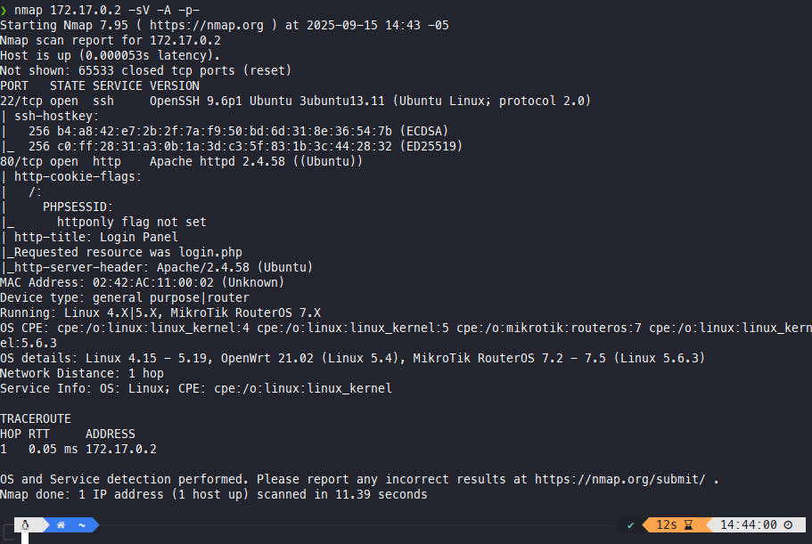
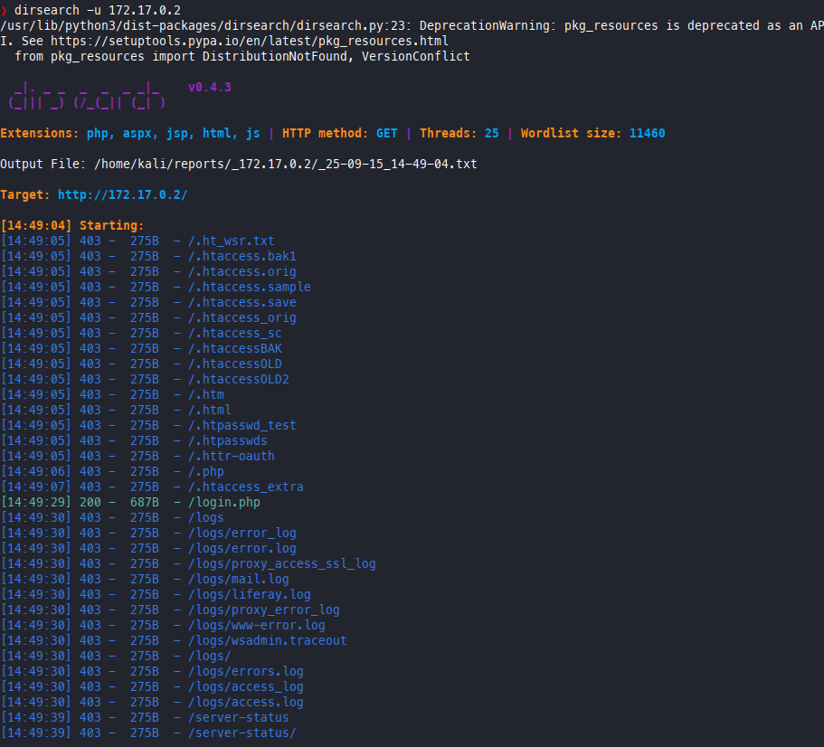
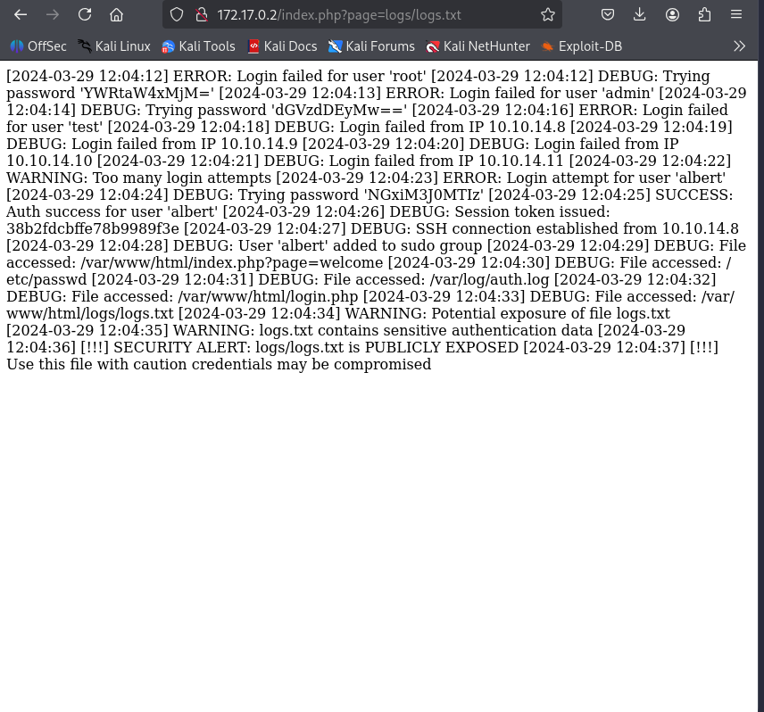
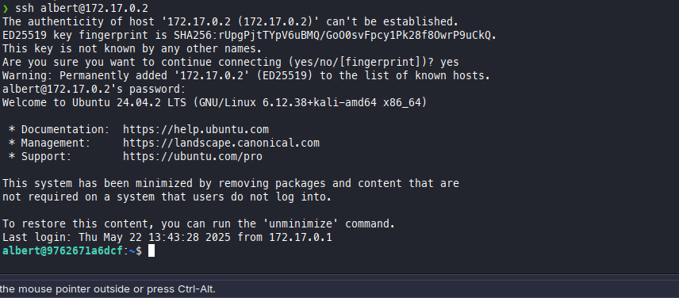
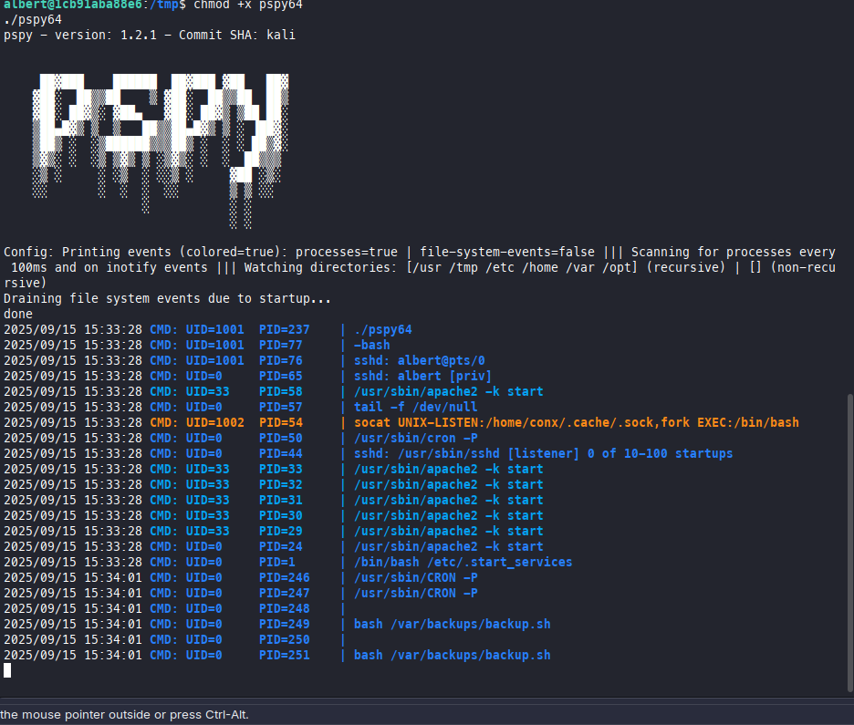
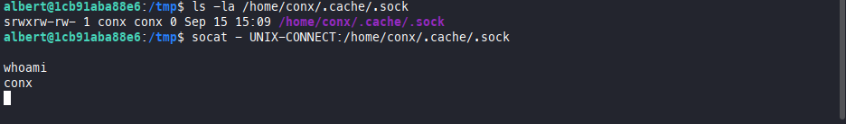

# BypassMe - Proceso de Explotación

## 1. Escaneo de Puertos y Servicios

Se realizó el siguiente comando para identificar los servicios expuestos:
```
nmap 172.17.0.2 -sV -A -p-
```
Resultado:


---

## 2. Enumeración de Directorios

Se utilizó dirsearch para buscar directorios y archivos accesibles:
```
dirsearch 172.17.0.2
```
Resultado:


---

## 3. Inyección SQL para Acceso Administrador

Se intentó una inyección SQL en el login usando:
- Usuario: `admin`
- Contraseña: `admin' or '1'='1`

Esto permitió el acceso como administrador y la visualización de los logs, donde se encontró una cuenta con su contraseña:


---

## 4. Intento de Conexión SSH

Con las credenciales obtenidas, se intentó una conexión SSH. Inicialmente no fue exitosa, pero finalmente se logró el acceso:


---

## 5. Ejecución de pspy para Monitoreo de Procesos

Se copió la herramienta `pspy` al sistema objetivo, se le dieron permisos de ejecución y se ejecutó:
```
chmod +x pspy64
./pspy64
```
Resultado:


---

## 6. Explotación de Socket

Con la información obtenida de pspy, se identificó la posibilidad de explotar un socket:


---