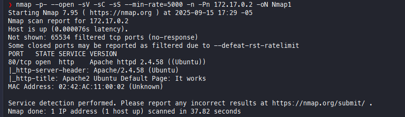
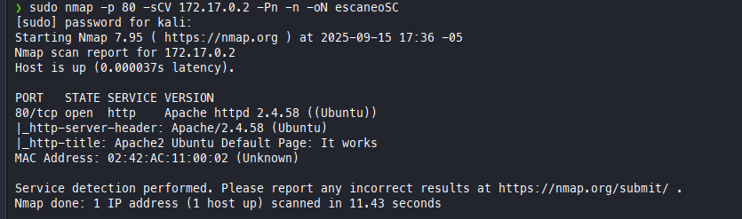
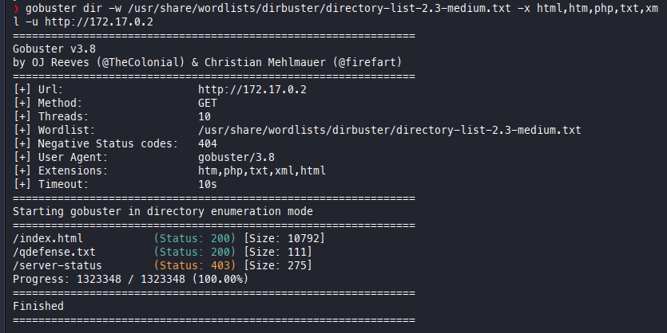
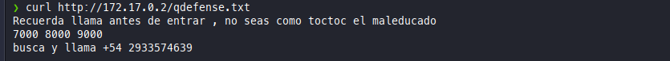
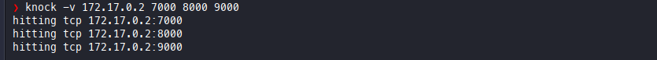
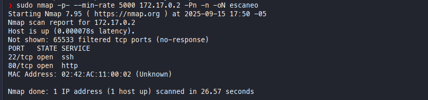

# Los 40 Ladrones - Proceso de Explotación

## 1. Escaneo Inicial de Puertos y Servicios

Se realizó un escaneo inicial con nmap:
```
nmap -p- --open -sV -sC -sS --min-rate=5000 -n -Pn 172.17.0.2 -oN Nmap1
```


---

## 2. Escaneo Específico del Puerto 80

Se realizó un escaneo más exhaustivo sobre el puerto 80:
```
sudo nmap -p 80 -sCV 172.17.0.2 -Pn -n -oN escaneoSC
```


---

## 3. Enumeración de Directorios con Gobuster

Se buscaron directorios y archivos en el servidor web:
```
gobuster dir -w /usr/share/wordlists/dirbuster/directory-list-2.3-medium.txt -x html,htm,php,txt,xml -u http://172.17.0.2
```


---

## 4. Revisión de Archivos Interesantes

Se identificó un archivo llamativo y se revisó su contenido:
```
curl http://172.17.0.2/qdefense.txt
```


---

## 5. Knock de Puertos

Se utilizó knock para interactuar con puertos observados previamente:


---

## 6. Escaneo Final de Puertos

Se realizó un nuevo escaneo de puertos tras el uso de knock:


---